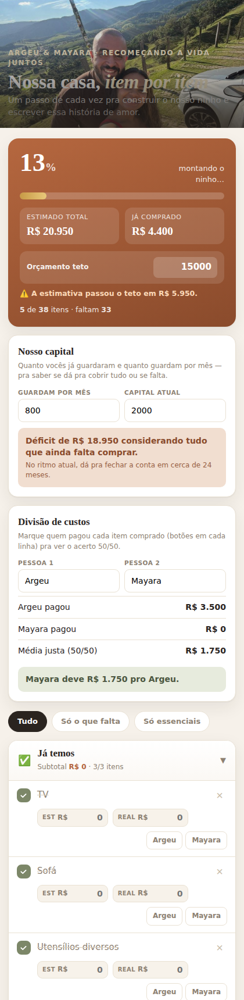

<p align="center">
  
</p>

<h1 align="center">🏡 Plano casa e vida nova</h1>
<p align="center">
  <em>O checklist da casa nova de <strong>Argeu &amp; Mayara</strong> — um passo prático dentro de uma história maior: recomeçar a vida e construir um lar juntos.</em>
</p>

<p align="center">
  
  
  
  
</p>

---

Este repositório guarda um site de uma página só, pra organizar o que já têm,
o que falta comprar, quanto isso custa e como o dinheiro está sendo dividido
e guardado — sem instalar nada, sem servidor, sem complicação.

<p align="center">
  
</p>

## ✨ O que o site faz

| | |
|---|---|
| ✅ **Checklist por cômodo** | Marque o que já resolveram e acompanhe o progresso geral (barra e %). |
| 💰 **Orçamento teto** | Defina um teto e veja se a estimativa está estourando ou com folga. |
| 🐷 **Nosso capital** | Informe quanto guardam por mês e o capital atual — o site calcula sozinho se está em déficit ou superávit, e em quantos meses (no ritmo atual) fecha a conta. |
| 🤝 **Divisão de custos** | Cada item tem valor estimado, valor real e "quem pagou" — o acerto 50/50 é calculado automaticamente. |
| 🔎 **Filtros** | Tudo / só o que falta / só essenciais. |
| ➕ **Totalmente editável** | Adicione itens e cômodos novos, remova o que não faz sentido, tudo direto na página. |
| ☁️ **Sincronização (opcional)** | Configurando o Firebase, os dados aparecem automaticamente nos dois aparelhos — veja abaixo. |
| ⬇️ **Backup / envio** | Botão "Baixar página" gera um HTML com os dados atuais embutidos. |

Tudo o que vocês editam fica salvo automaticamente no navegador
(`localStorage`). Com a sincronização configurada, também aparece na hora no
aparelho do outro.

## 🚀 Como usar

Só abrir o [`index.html`](./index.html) direto no navegador (duplo clique ou
"Abrir com..."). Não precisa de internet nem instalar nada — as únicas
chamadas externas são as fontes do Google Fonts (Fraunces/Inter) e, se
configurada, a sincronização com a nuvem.

Pra trocar a foto de capa, basta substituir
[`assets/capa-argeu-mayara.jpg`](./assets/capa-argeu-mayara.jpg) por outra
imagem com o mesmo nome (ou editar o `src` da tag `` no início do
`index.html`).

## ☁️ Sincronização entre os dois (Firebase, opcional)

<details>
<summary><strong>Por padrão, cada navegador/aparelho guarda seus próprios dados.</strong> Clique aqui pra ver o passo a passo de como sincronizar em tempo real entre os dois aparelhos, de graça.</summary>

<br>

O site já vem preparado pra usar o **Firebase** (gratuito, do Google). É só
configurar uma vez:

1. Acesse **https://console.firebase.google.com** e crie um projeto novo
   (gratuito, plano Spark).
2. No menu lateral, vá em **Build → Authentication** → aba "Sign-in method" →
   ative **E-mail/senha**.
3. Ainda em Authentication, aba **Users**, clique em "Add user" e cadastre
   **duas contas** (uma pro Argeu, outra pra Mayara — pode usar os e-mails de
   vocês e uma senha à escolha).
4. No menu lateral, vá em **Build → Firestore Database** → "Create database" →
   escolha uma região próxima → inicie em modo produção.
5. Na aba **Rules** do Firestore, substitua o conteúdo por:

   ```
   rules_version = '2';
   service cloud.firestore {
     match /databases/{database}/documents {
       match /{document=**} {
         allow read, write: if request.auth != null;
       }
     }
   }
   ```

   Isso garante que só quem estiver logado com uma das duas contas criadas
   no passo 3 consegue ler ou escrever os dados.
6. Volte pra tela inicial do projeto (ícone de engrenagem → "Project settings")
   → em "Your apps", clique no ícone `</>` (Web) → registre um app (não
   precisa de Firebase Hosting) → copie o objeto `firebaseConfig` que
   aparece.
7. Abra o `index.html` neste repositório e cole os valores copiados no topo
   do `<script id="mainjs">`, no bloco `FIREBASE_CONFIG` (substituindo cada
   `"COLOQUE_AQUI"`). Faça commit e push.

Depois disso, ao abrir o site aparecerá uma tela de login — cada um entra
com sua conta (criada no passo 3) e os dados passam a sincronizar sozinhos
entre os dois aparelhos. Quem preferir pode clicar em "Continuar sem
sincronizar" pra usar só localmente naquele aparelho.

</details>

## 🌐 Como publicar como site (opcional)

<details>
<summary>Pra ter um link público e acessar de qualquer lugar/dispositivo, clique aqui.</summary>

<br>

1. Vá em **Settings → Pages** neste repositório no GitHub.
2. Em "Source", selecione **Deploy from a branch**, a branch `main` e a
   pasta `/ (root)` → **Save**.
3. Confirme que aparece a faixa verde "Your site is live at...". O primeiro
   deploy pode levar alguns minutos. A URL fica assim:
   `https://<usuário>.github.io/<repositório>/`.

Sem a sincronização via Firebase configurada, cada dispositivo/navegador
guarda seu próprio progresso — use o botão "Baixar página" pra levar os
dados de um lugar pro outro nesse caso.

</details>

## 🧱 Stack

HTML, CSS e JavaScript puros — um único arquivo (`index.html`), sem
dependência de build, framework ou servidor. Sincronização via Firebase
(Auth + Firestore) é totalmente opcional.

---

<p align="center"><sub>Feito com carinho pra casa e vida nova de Argeu &amp; Mayara 💛</sub></p>
